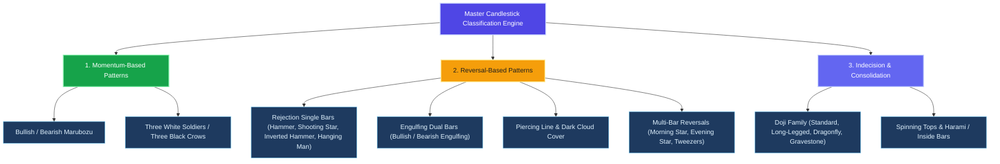
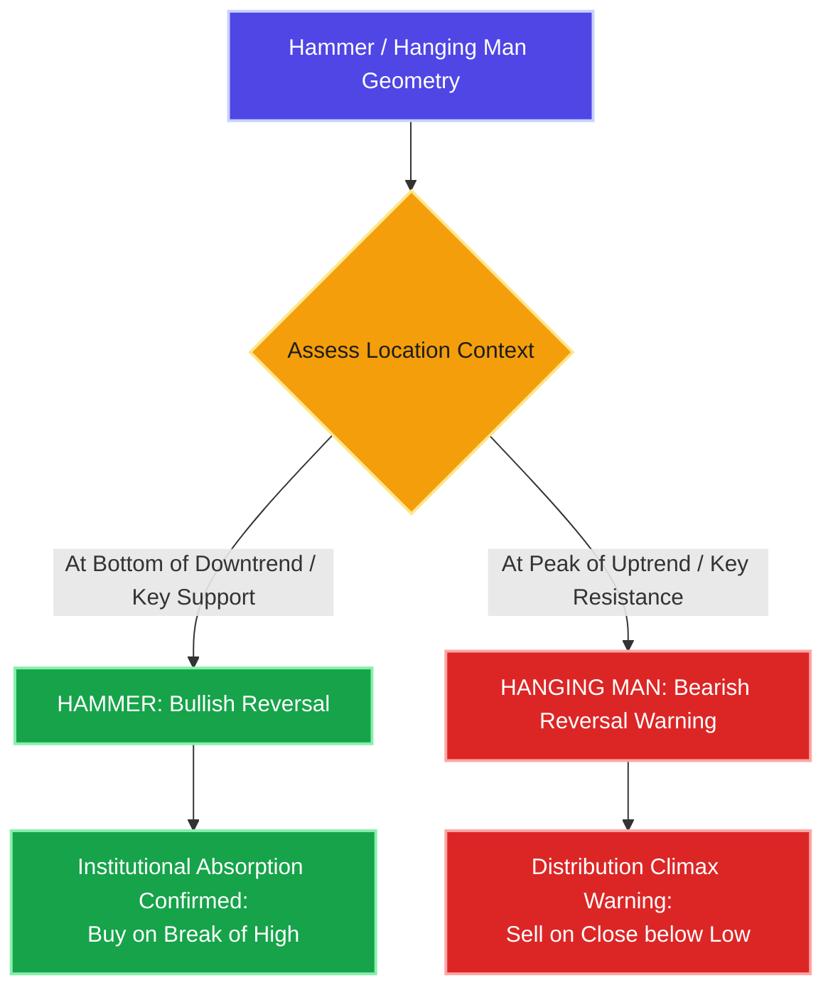
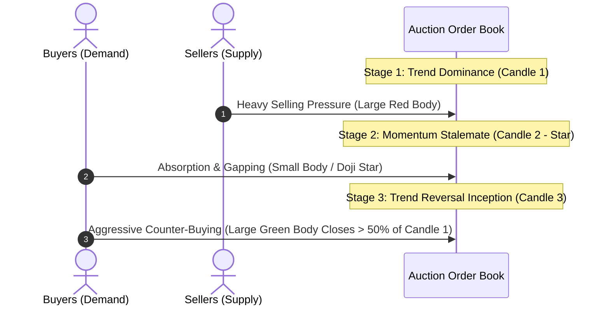
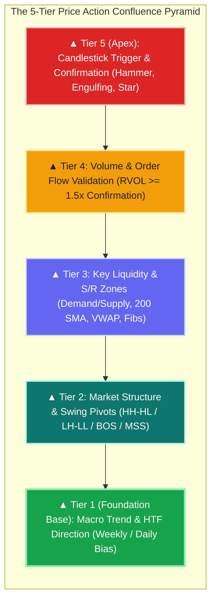
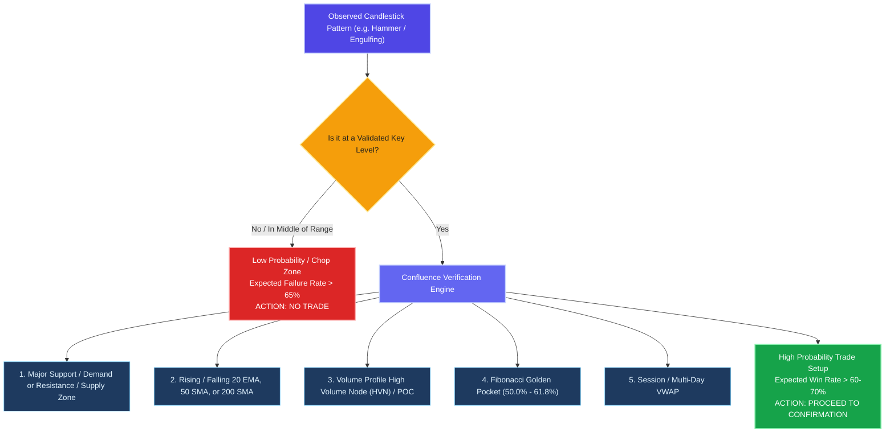
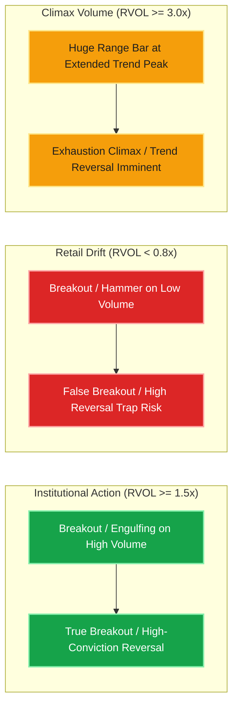
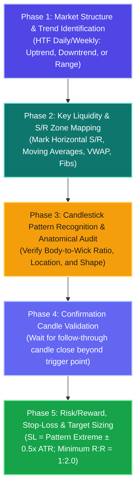
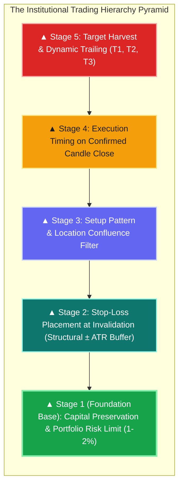
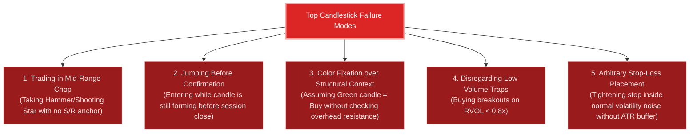
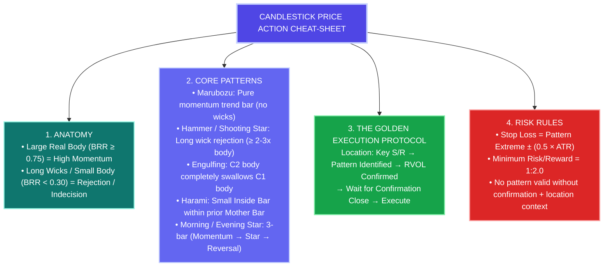

# Candlestick Patterns & Price Action Technical Architecture Master Guide

Welcome to the **Candlestick Price Action & Technical Analysis Research Lab** reference documentation. This master guide transforms foundational and advanced price action principles, candlestick anatomy, market psychology, volume dynamics, and execution rules into an exhaustive, production-grade technical manual for quantitative and discretionary traders.

---

## 📑 Master Table of Contents
1. [Core Anatomy & Mathematical Architecture of Candlesticks](#1-core-anatomy--mathematical-architecture-of-candlesticks)
2. [Market Psychology & Candlestick Classification Engine](#2-market-psychology--candlestick-classification-engine)
3. [Single-Candle Pattern Deep Dive](#3-single-candle-pattern-deep-dive)
   * 3.1 [Marubozu (Bullish & Bearish)](#31-marubozu-bullish--bearish)
   * 3.2 [Spinning Top](#32-spinning-top)
   * 3.3 [The Doji Family (Standard, Long-Legged, Dragonfly, Gravestone)](#33-the-doji-family-standard-long-legged-dragonfly-gravestone)
   * 3.4 [Hammer & Hanging Man](#34-hammer--hanging-man)
   * 3.5 [Shooting Star & Inverted Hammer](#35-shooting-star--inverted-hammer)
4. [Dual-Candle Pattern Deep Dive](#4-dual-candle-pattern-deep-dive)
   * 4.1 [Engulfing Patterns (Bullish & Bearish)](#41-engulfing-patterns-bullish--bearish)
   * 4.2 [Harami / Inside Bar Patterns (Bullish & Bearish)](#42-harami--inside-bar-patterns-bullish--bearish)
   * 4.3 [Piercing Line & Dark Cloud Cover](#43-piercing-line--dark-cloud-cover)
   * 4.4 [Tweezer Bottom & Tweezer Top](#44-tweezer-bottom--tweezer-top)
5. [Triple-Candle Pattern Deep Dive](#5-triple-candle-pattern-deep-dive)
   * 5.1 [Morning Star & Evening Star](#51-morning-star--evening-star)
   * 5.2 [Three White Soldiers & Three Black Crows](#52-three-white-soldiers--three-black-crows)
6. [The "Location & Context is King" Framework](#6-the-location--context-is-king-framework)
7. [Volume Dynamics & Quantitative Validation (RVOL)](#7-volume-dynamics--quantitative-validation-rvol)
8. [The 5-Phase Institutional Trade Execution Pipeline](#8-the-5-phase-institutional-trade-execution-pipeline)
9. [Comprehensive Pattern Comparison & Decision Matrix](#9-comprehensive-pattern-comparison--decision-matrix)
10. [Real-World Trade Setups & Execution Case Studies](#10-real-world-trade-setups--execution-case-studies)
11. [Common Traps, Failure Modes & Behavioral Discipline](#11-common-traps-failure-modes--behavioral-discipline)
12. [Master Technical Interview & Certification Q&A Bank](#12-master-technical-interview--certification-qa-bank)
13. [Final 1-Minute Executive Revision Cheat-Sheet](#13-final-1-minute-executive-revision-cheat-sheet)

---

# 1. Core Anatomy & Mathematical Architecture of Candlesticks

### Concept Overview
A Japanese candlestick represents price action over a specified timeframe (e.g., 1-Minute, 15-Minute, 1-Hour, Daily, Weekly) by encoding four essential data points: **Open ($O$), High ($H$), Low ($L$), and Close ($C$)**.

Unlike standard line charts that only plot closing prices, candlesticks visualize the intra-period continuous auction between aggressive buyers (demand) and aggressive sellers (supply).

```
           BULLISH CANDLE (Green)                        BEARISH CANDLE (Red)

                    │  <── High Price (Upper Wick)                │  <── High Price (Upper Wick)
                    │                                             │
               ┌─────────┐                                   ┌─────────┐
               │  CLOSE  │  <── Upper Body Edge (Close)      │  OPEN   │  <── Upper Body Edge (Open)
               │         │                                   │         │
               │  GREEN  │  <── Real Body                    │   RED   │  <── Real Body
               │  BODY   │      (Price Gain: Close > Open)   │  BODY   │      (Price Loss: Close < Open)
               │         │                                   │         │
               │  OPEN   │  <── Lower Body Edge (Open)       │  CLOSE  │  <── Lower Body Edge (Close)
               └─────────┘                                   └─────────┘
                    │                                             │
                    │  <── Low Price (Lower Wick)                 │  <── Low Price (Lower Wick)
```

### 📐 Candlestick Anatomy Made Simple: The 4 Core Measurements

Every candlestick is built from **4 price points (OHLC)**:
* **High ($H$)**: The absolute peak price reached in the session.
* **Low ($L$)**: The absolute lowest price reached in the session.
* **Open ($O$)**: The starting price when the session opened.
* **Close ($C$)**: The final finishing price when the session closed.

---

#### 1. Total Candle Range (Full Candle Height)
* **Simple Formula**: `Total Range = High - Low`
* **In Plain English**: The entire vertical distance from the top tip of the upper wick to the bottom tip of the lower wick. It measures **total volatility and the full price battlefield**.
* **Real-World Example**: If High = ₹105 and Low = ₹95, then `Total Range = ₹105 - ₹95 = ₹10`.

#### 2. Real Body Size (The Solid Box)
* **Simple Formula**: `Real Body = Difference between Open and Close`
  * **Bullish (Green Candle)**: `Body = Close - Open` (Price went UP $\implies$ Buyers won).
  * **Bearish (Red Candle)**: `Body = Open - Close` (Price went DOWN $\implies$ Sellers won).
* **In Plain English**: The solid block that shows who won the session and how far they pushed price from the starting line.
* **Real-World Example**: If a Green candle Opens at ₹96 and Closes at ₹104, then `Real Body = ₹104 - ₹96 = ₹8`.

#### 3. Upper Wick (Top Tail / Rejection of Highs)
* **Simple Formula**:
  * **Green Candle**: `Upper Wick = High - Close`
  * **Red Candle**: `Upper Wick = High - Open`
* **In Plain English**: The top line showing how far sellers pushed price back down after buyers reached the session peak.
* **Real-World Example**: If High = ₹105 and Green Candle Closes at ₹104, then `Upper Wick = ₹105 - ₹104 = ₹1`.

#### 4. Lower Wick (Bottom Tail / Rejection of Lows)
* **Simple Formula**:
  * **Green Candle**: `Lower Wick = Open - Low`
  * **Red Candle**: `Lower Wick = Close - Low`
* **In Plain English**: The bottom line showing how far buyers pushed price back up after sellers dragged it to the session bottom.
* **Real-World Example**: If Green Candle Opens at ₹96 and Low = ₹95, then `Lower Wick = ₹96 - ₹95 = ₹1`.

---

### 📊 The "Body-to-Range Ratio" (BRR): Measuring Who is in Control

**What is BRR?** It simply answers: **"What percentage of the entire candle is solid body vs empty wicks?"**

$$\text{Body-to-Range \%} = \frac{\text{Real Body Size}}{\text{Total Candle Range}} \times 100\%$$

```
   ┌───────────────────────┬───────────────────────┬───────────────────────┐
   │    BIG BODY (≥ 75%)   │   MEDIUM BODY (30-75%)│    SMALL BODY (< 30%) │
   ├───────────────────────┼───────────────────────┼───────────────────────┤
   │                       │           │           │           │           │
   │      ┌─────────┐      │      ┌─────────┐      │           │           │
   │      │         │      │      │         │      │      ┌─────────┐      │
   │      │  SOLID  │      │      │  BODY   │      │      │  BODY   │      │
   │      │  BODY   │      │      │         │      │      └─────────┘      │
   │      │         │      │      └─────────┘      │           │           │
   │      └─────────┘      │           │           │           │           │
   │                       │                       │           │           │
   │   (High Momentum)     │    (Normal Trend)     │ (Rejection/Indecision)│
   └───────────────────────┴───────────────────────┴───────────────────────┘
```

#### Quick-Interpretation Cheat Sheet:

| Body Size % | Category | Market Psychology & Meaning | Classic Examples |
| :--- | :--- | :--- | :--- |
| **$\ge 75\%$ (Big Body)** | **High Momentum & Trend Dominance** | One side took total control from start to finish. Almost zero wicks. Unrelenting buying or selling pressure. | **Marubozu**, Large Breakout Trend Bars |
| **$30\% \text{ to } 75\%$ (Medium Body)** | **Standard Healthy Trend Bar** | Directional progress with normal healthy intra-session pullbacks. | Standard Daily/Hourly Trend Bars |
| **$< 30\%$ (Small Body)** | **Rejection & Indecision** | Wicks dominate $70\%+$ of the candle. Buyers and sellers rejected extreme prices or fought to a stalemate. | **Hammer**, **Shooting Star**, **Spinning Top**, **Doji** ($< 5\%$) |

---

# 2. Market Psychology & Candlestick Classification Engine

Candlestick patterns are categorized into three core psychological classifications:



### Psychological Mechanics

| Classification | Buyer / Seller Dynamic | Volume Profile Expectation | Tactical Response |
| :--- | :--- | :--- | :--- |
| **Momentum** | One side completely dominates order flow from open to close. | Expanding ($RVOL > 1.5x$) | Join trend continuation or breakout on pullback. |
| **Reversal** | Aggressive push by one side met with overwhelming institutional absorption and counter-rejection. | Climax or Above Average ($RVOL \ge 1.3x$) at S/R | Prepare counter-trend or reversal entry upon confirmation. |
| **Indecision** | Supply and demand reach transient equilibrium; neither side controls closing price. | Contraction ($RVOL < 0.8x$) or Volatility Squeeze | Stand aside; mark high/low boundaries for breakout expansion. |

---

# 3. Single-Candle Pattern Deep Dive

---

## 3.1 Marubozu (Bullish & Bearish)

### Concept & Definition
A **Marubozu** (Japanese for "bald head" or "shaved head") is a candlestick with a very large real body and virtually zero upper or lower shadows ($BRR \ge 0.90$).

```
           BULLISH MARUBOZU (Green)                      BEARISH MARUBOZU (Red)
            High = Close (No Upper Wick)                  High = Open (No Upper Wick)
               ┌─────────┐                                   ┌─────────┐
               │  CLOSE  │                                   │  OPEN   │
               │         │                                   │         │
               │  GREEN  │ (100% Demand Conviction)          │   RED   │ (100% Supply Conviction)
               │  BODY   │                                   │  BODY   │
               │         │                                   │         │
               │  OPEN   │                                   │  CLOSE  │
               └─────────┘                                   └─────────┘
            Low = Open (No Lower Wick)                    Low = Close (No Lower Wick)
```

### How It Works & Market Psychology
* **Bullish Marubozu ($Open = Low$, $Close = High$)**: Buyers aggressive from the first tick of the session; price never dipped below open. Close occurred at the absolute high. Signals extreme demand and institutional buying pressure.
* **Bearish Marubozu ($Open = High$, $Close = Low$)**: Sellers dominated throughout; price never rose above open. Close occurred at the absolute low. Signals aggressive liquidation or short initiation.

### Quantitative & Tactical Parameters
* **Optimal Location**: Breakout from a multi-week horizontal base, ascending/descending triangle, or high-volume moving average reclaim.
* **Volume Requirement**: $RVOL \ge 1.8x$ (Essential to validate institutional participation).
* **Entry Trigger**: Aggressive entry on close of Marubozu; Conservative entry on 50% body pullback.
* **Stop Loss**: $1 \text{ tick below}$ the Marubozu open minus $0.5 \times \text{ATR}$.
* **Target**: $1.618$ Fibonacci extension or measured height of the broken consolidation.

> [!TIP]
> The **50% midpoint of a Marubozu body** acts as a powerful dynamic support (Bullish) or resistance (Bearish) zone during subsequent pullbacks.

---

## 3.2 Spinning Top

### Concept & Definition
A **Spinning Top** is a single candle featuring a small real body centered between upper and lower shadows of approximately equal, moderate length.

```
                                SPINNING TOP (Indecision)
                                           │
                                           │  <── Upper Wick (Rejection of Highs)
                                           │
                                      ┌─────────┐
                                      │  Body   │  <── Small Real Body (Open ≈ Close)
                                      └─────────┘
                                           │
                                           │  <── Lower Wick (Rejection of Lows)
                                           │
```

### How It Works & Market Psychology
Buyers attempted to push price higher during the session, but were met with selling pressure. Sellers attempted to push price lower, but were met with buyer absorption. Price settled near its open, representing a temporary stalemate.

### Best Practices & Strategy
* **Do NOT trade a Spinning Top in isolation**.
* In an extended trend, a Spinning Top signals **momentum deceleration** and potential exhaustion.
* In a trading range, a Spinning Top confirms ongoing consolidation.
* **Execution Strategy**: Bracket the High and Low of the Spinning Top. Enter in the direction of the subsequent breakout candle.

---

## 3.3 The Doji Family (Standard, Long-Legged, Dragonfly, Gravestone)

### Concept & Definition
A **Doji** is formed when the opening and closing prices are virtually identical ($Open \approx Close$), resulting in a horizontal line or razor-thin real body ($BRR \le 0.05$).

```
   1. STANDARD DOJI        2. LONG-LEGGED DOJI       3. DRAGONFLY DOJI       4. GRAVESTONE DOJI
     (Indecision)             (Violent Tug-of-War)     (Bullish Reversal)      (Bearish Reversal)

          │                            │                                               │
          │                            │                                               │
          │                            │                                               │
     ─────┼─────                  ─────┼─────               ═════╤═════               │
          │                            │                   (High=Open=Close)           │
          │                            │                            │             ═════╧═════
          │                            │                            │          (Low=Open=Close)
                                       │                            │
                                       │                            │
```

### In-Depth Breakdown of Doji Variations

| Doji Variant | Anatomy | Location & Market Implication | Execution Rule |
| :--- | :--- | :--- | :--- |
| **Standard Doji** | Cross shape, balanced short shadows. | Trend exhaustion or consolidation equilibrium. | Await directional confirmation candle break. |
| **Long-Legged Doji** | Very long upper and lower shadows. | Extreme market volatility and violent tug-of-war. | High risk; trade breakout of extreme highs/lows. |
| **Dragonfly Doji** | Long lower shadow, no upper shadow ($O=C=H$). | **Bullish Reversal** at key Support/Demand zone. | Buy on next candle break above high; SL below low. |
| **Gravestone Doji** | Long upper shadow, no lower shadow ($O=C=L$). | **Bearish Reversal** at key Resistance/Supply zone. | Short on next candle break below low; SL above high. |

---

## 3.4 Hammer & Hanging Man

### Structural Anatomy
Both patterns share identical visual geometry: a small real body at the upper end of the trading range with a **long lower shadow (at least $2\text{ to }3\times$ the body height)** and negligible upper shadow ($S_{\text{upper}} \le 0.1 \times B_{\text{spread}}$).

```
           HAMMER (Bullish at Support)                   HANGING MAN (Bearish at Resistance)
                   (No Upper Wick)                               (No Upper Wick)
                     ┌─────────┐                                   ┌─────────┐
                     │GREEN/RED│                                   │RED/GREEN│  <── Small Real Body
                     └─────────┘                                   └─────────┘
                          │                                             │
                          │                                             │
                          │  <── Long Lower Wick                        │  <── Long Lower Wick
                          │      (≥ 2-3x Body Height)                   │      (≥ 2-3x Body Height)
                          │      (Intraday Buying Rejection)            │      (Intraday Selling Warning)
                          │                                             │
```



### Crucial Principle: Location Determines Meaning, Not Color
* **Color Impact**: A green hammer is marginally more bullish than a red hammer (since buyers managed to close above open), but **location at a major support zone is $10\times$ more significant than candle color**.
* **Hammer (at Support)**: Sellers pushed price aggressively lower, but institutional demand absorbed all supply and drove price back to close near session highs.
* **Hanging Man (at Resistance)**: Intraday sell-off indicates that supply is beginning to overwhelm demand. If confirmed by a subsequent bearish candle, it confirms distribution.

---

## 3.5 Shooting Star & Inverted Hammer

### Structural Anatomy
Both patterns feature a small real body at the lower end of the range with a **long upper shadow (at least $2\text{ to }3\times$ the body height)** and negligible lower shadow.

```
        SHOOTING STAR (Bearish at Resistance)          INVERTED HAMMER (Bullish at Support)
                          │                                             │
                          │  <── Long Upper Wick                        │  <── Long Upper Wick
                          │      (≥ 2-3x Body Height)                   │      (≥ 2-3x Body Height)
                          │      (Intraday Selling Rejection)           │      (Bullish Liquidity Probe)
                          │                                             │
                     ┌─────────┐                                   ┌─────────┐
                     │RED/GREEN│  <── Small Real Body              │GREEN/RED│  <── Small Real Body
                     └─────────┘                                   └─────────┘
                   (No Lower Wick)                               (No Lower Wick)
```

### Psychological Breakdown

| Feature | Shooting Star | Inverted Hammer |
| :--- | :--- | :--- |
| **Prior Trend** | Established Uptrend | Established Downtrend |
| **Location** | Major Resistance / 52-Week High / Supply | Major Support / Base / 52-Week Low |
| **Sentiment** | **Bearish Reversal**: Bulls tried to push higher but suffered complete intraday liquidation. | **Bullish Reversal Setup**: Buyers tested higher liquidity; sellers pushed back, but selling momentum halted. |
| **Confirmation** | Next candle closes **below** the Shooting Star body. | Next candle closes **above** the Inverted Hammer high on expanding volume. |
| **Stop Loss** | Above the upper shadow tip $+ 0.5 \times \text{ATR}$. | Below the low of the candle base $- 0.5 \times \text{ATR}$. |

---

# 4. Dual-Candle Pattern Deep Dive

---

## 4.1 Engulfing Patterns (Bullish & Bearish)

### Concept & Mechanics
An **Engulfing Pattern** consists of two consecutive opposite-colored candles where the real body of the second candle completely covers (engulfs) the real body of the first candle.

```
            BULLISH ENGULFING (Support)                   BEARISH ENGULFING (Resistance)
                 │                                             │          │
              ┌─────┐      ┌───────────┐                    ┌─────┐    ┌───────────┐
              │ RED │      │           │                    │GREEN│    │           │
              │ C1  │      │   GREEN   │                    │ C1  │    │    RED    │
              └─────┘      │    C2     │                    └─────┘    │    C2     │
                 │         │ (Engulfs) │                       │       │ (Engulfs) │
                           │           │                               │           │
                           └───────────┘                               └───────────┘
                                 │                                           │
```

### Quantitative Validation Rules
1. **Body Overlap**: Second candle body must fully encompass the first candle's Open-to-Close span.
2. **Volume Requirement**: Volume on Candle 2 must be **significantly greater** than Candle 1 ($V_2 > 1.3 \times V_1$).
3. **Trend Context**: Must appear after a defined multi-candle directional swing (minimum 5–10 candles).

---

## 4.2 Harami / Inside Bar Patterns (Bullish & Bearish)

### Concept & Mechanics
The **Harami** (Japanese for "pregnant") or **Inside Bar** is a two-candle pattern where the second candle's entire range (or body) is completely contained within the body of the preceding large "Mother Candle".

```
             BULLISH HARAMI (Support)                      BEARISH HARAMI (Resistance)
                 │                                             │
           ┌───────────┐                                 ┌───────────┐
           │           │                                 │           │
           │    RED    │         │                       │   GREEN   │         │
           │  MOTHER   │      ┌─────┐                    │  MOTHER   │      ┌─────┐
           │    C1     │      │GREEN│ (Inside Bar)       │    C1     │      │ RED │ (Inside Bar)
           │           │      └─────┘                    │           │      └─────┘
           └───────────┘         │                       └───────────┘         │
                 │                                             │
```

### Market Psychology & Volatility Squeeze
* The Harami represents **sudden volatility compression and trend cessation**.
* The aggressive momentum of the mother bar is completely halted.
* **Breakout Trading Strategy**: Place buy-stop orders above Mother Bar High and sell-stop orders below Mother Bar Low.

---

## 4.3 Piercing Line & Dark Cloud Cover

### Concept & Structural Criteria

```
           PIERCING LINE (Support Reversal)             DARK CLOUD COVER (Resistance Reversal)
                 │                                                        │
           ┌───────────┐         │                                     ┌─────┐
           │    RED    │         │                                     │     │
           │  CANDLE 1 │    ┌─────────┐                                │ RED │ (Gaps Up Open)
     ──────┤ - - 50% - ├────┤  GREEN  ├──────                   ───────┤ C2  ├───── - - 50% - -──────
           │           │    │ CANDLE 2│ (Closes > 50%)                 │     │     ┌───────────┐
           └───────────┘    │         │                                └─────┘     │   GREEN   │
                 │          │(Gaps Dn)│                                   │        │  CANDLE 1 │
                            └─────────┘                                            └───────────┘
                                 │                                                       │
```

> [!IMPORTANT]
> If Candle 2 does not penetrate and close past the **50% median line** of Candle 1, the pattern is considered weak or incomplete and should not be traded.

---

## 4.4 Tweezer Bottom & Tweezer Top

### Concept & Rejection Mechanics
* **Tweezer Bottom**: Two consecutive candles sharing the **exact same price low** at a major support zone (dual rejection of a horizontal floor).
* **Tweezer Top**: Two consecutive candles sharing the **exact same price high** at a major resistance ceiling (dual rejection of an overhead barrier).

```
          TWEEZER BOTTOM (Support Floor)                TWEEZER TOP (Resistance Ceiling)
                 │            │                      High 1 ───┴─── High 2 (Identical Highs)
              ┌─────┐      ┌─────┐                         ┌─────┐      ┌─────┐
              │ RED │      │GREEN│                         │GREEN│      │ RED │
              └─────┘      └─────┘                         └─────┘      └─────┘
                 │            │                               │            │
           Low 1 ───┴─── Low 2 (Identical Lows)
```

---

# 5. Triple-Candle Pattern Deep Dive

---

## 5.1 Morning Star & Evening Star

### Structural 3-Stage Lifecycle
The **Morning Star** (Bullish) and **Evening Star** (Bearish) represent complete, three-phase institutional trend reversals:



### Visual Schematic

```
            MORNING STAR (Bullish Reversal)               EVENING STAR (Bearish Reversal)
                 │                                                        │ (Star C2)
              ┌─────┐                                                  ┌─────┐
              │ RED │                                                  └─────┘
              │ C1  │                                              │      │      │
              └─────┘             │ (Green C3)                  ┌─────┐   │   ┌─────┐
                 │             ┌─────┐                          │GREEN│   │   │ RED │
                               │GREEN│                          │ C1  │       │ C3  │
                      │ (Star) │ C3  │                          └─────┘       └─────┘
                   ┌─────┐     └─────┘                             │             │
                   └─────┘        │
                      │
```

---

## 5.2 Three White Soldiers & Three Black Crows

### Concept & Trend Inception Mechanics
* **Three White Soldiers**: Three consecutive large green candles, each opening within the previous candle's body and closing at fresh highs with small or no wicks. Indicates **powerful institutional accumulation and sustained trend inception**.
* **Three Black Crows**: Three consecutive large red candles, each opening within the previous candle's body and closing at fresh lows. Indicates **severe institutional distribution and accelerating trend breakdown**.

### Visual Schematic

```
         THREE WHITE SOLDIERS (Bullish Inception)        THREE BLACK CROWS (Bearish Breakdown)
                                       │                               │
                                    ┌─────┐                         ┌─────┐
                                    │GREEN│ (C3)                    │ RED │ (C1)
                                    │     │                         └─────┘
                             │      └─────┘                            │      │
                          ┌─────┐      │                                   ┌─────┐
                          │GREEN│ (C2)                                     │ RED │ (C2)
                          │     │                                          └─────┘
                   │      └─────┘                                             │      │
                ┌─────┐      │                                                    ┌─────┐
                │GREEN│ (C1)                                                      │ RED │ (C3)
                │     │                                                           └─────┘
                └─────┘                                                              │
                   │
```

---

# 6. The "Location & Context is King" Framework

> ### 🛑 The Golden Rule of Technical Analysis:
> **A candlestick pattern has ZERO statistical edge when traded in isolation.**
> Its validity, win rate, and expectancy depend entirely on **WHERE** it forms relative to the underlying market structure.

### The 5-Tier Price Action Confluence Pyramid



### Confluence Verification Engine



---

# 7. Volume Dynamics & Quantitative Validation (RVOL)

Volume represents the fuel of price action. Volume confirms whether a candlestick pattern was created by retail traders or institutional market makers.

### Relative Volume Formula
$$RVOL = \frac{\text{Current Period Volume}}{\text{Average Volume of the same period over 20 days}}$$

### Volume Confirmation Matrix



---

# 8. The 5-Phase Institutional Trade Execution Pipeline

Every trade based on candlestick patterns must strictly pass through this 5-stage pipeline:



### Capital Preservation & Trade Execution Pyramid



### Execution Parameters Specification
* **Confirmation Candle Requirement**:
  * For Bullish Setups: Next candle must break and close **above the high** of the signal candle.
  * For Bearish Setups: Next candle must break and close **below the low** of the signal candle.
* **Stop Loss Formula**:
  $$\text{Stop Loss}_{\text{Long}} = \text{Pattern Low} - (0.5 \times \text{ATR})$$
  $$\text{Stop Loss}_{\text{Short}} = \text{Pattern High} + (0.5 \times \text{ATR})$$
* **Profit Target Hierarchy**:
  * **$T_1$**: Nearest Major S/R ($1:1 \text{ to } 1:1.5 \text{ R:R}$) $\implies$ Trim $40\%$, move stop to Breakeven.
  * **$T_2$**: Structural Measured Move ($1:2 \text{ to } 1:2.5 \text{ R:R}$) $\implies$ Trim $40\%$.
  * **$T_3$**: Fibonacci Extension ($1.618 / 2.618$) $\implies$ Trail remaining $20\%$ with 20 EMA.

---

# 9. Comprehensive Pattern Comparison & Decision Matrix

| Pattern Name | Class | Optimal Prior Trend | Critical Location | Trigger Condition | Stop-Loss Placement | Win Rate Edge (Confluence) |
| :--- | :--- | :--- | :--- | :--- | :--- | :--- |
| **Bullish Marubozu** | Momentum | Consolidating / Breakout | Resistance Breakout | Close of Marubozu / 50% Retest | Below Marubozu Open | Very High ($\approx 70\%$) |
| **Bearish Marubozu** | Momentum | Breakdown | Support Breakdown | Close of Marubozu / 50% Retest | Above Marubozu Open | Very High ($\approx 70\%$) |
| **Hammer** | Reversal | Downtrend (Oversold) | Major Support / 200 SMA | Break & Close above Hammer High | Below Hammer Low | High ($\approx 65\%$) |
| **Shooting Star** | Reversal | Uptrend (Overbought) | Major Resistance / Supply | Break & Close below Star Low | Above Star High | High ($\approx 65\%$) |
| **Bullish Engulfing**| Reversal | Downtrend | Demand Zone / VWAP | Close above prior Red Open | Below Engulfing Low | High ($\approx 68\%$) |
| **Bearish Engulfing**| Reversal | Uptrend | Supply Zone / Dynamic MA | Close below prior Green Open | Above Engulfing High | High ($\approx 68\%$) |
| **Morning Star** | Reversal | Prolonged Downtrend | Historical Demand Base | Close of 3rd Green Candle | Below Star (Candle 2) Low| Very High ($\approx 72\%$) |
| **Evening Star** | Reversal | Extended Rally | Overhead Supply Ceiling | Close of 3rd Red Candle | Above Star (Candle 2) High| Very High ($\approx 72\%$) |
| **Bullish Harami** | Indecision / Rev | Downtrend Pullback | Dynamic 20/50 EMA Base | Breakout above Mother High | Below Mother Low | Moderate ($\approx 60\%$) |
| **Bearish Harami** | Indecision / Rev | Uptrend Extension | Overhead Channel Top | Breakdown below Mother Low | Above Mother High | Moderate ($\approx 60\%$) |
| **Spinning Top** | Indecision | Anywhere | Range Boundaries | Breakout of High / Low | Opposite boundary | Neutral ($\approx 50\%$) |
| **Doji (Standard)** | Indecision | Trend Peak / Trough | Major S/R Pivot | Directional follow-through bar | Opposite side of Doji range | Moderate ($\approx 58\%$) |

---

# 10. Real-World Trade Setups & Execution Case Studies

### Case Study 1: Bullish Hammer at 200 SMA Confluence (RELIANCE - Daily Chart)

```
Context:
• Asset: RELIANCE (NSE)
• Higher-Timeframe Trend: Daily Uptrend (Making Higher Highs)
• Daily 200 SMA: ₹2,840.00
• Previous Swing Low Demand Zone: ₹2,835.00 – ₹2,845.00
• Daily ATR (14): ₹42.00

Observation:
• Stock pulls back 6 consecutive days into the ₹2,840 zone.
• A textbook Bullish Hammer forms:
  - Open: ₹2,848.00 | High: ₹2,855.00 | Low: ₹2,812.00 | Close: ₹2,852.00
  - Lower shadow = ₹36.00 (3.6x Real Body of ₹10.00)
  - Volume: 11.2M shares (RVOL = 1.85x vs 20-day average)

Execution Architecture:
1. Confirmation Trigger: Next daily candle breaks and closes above ₹2,855.00.
2. Entry Price: ₹2,860.00
3. Stop Loss: ₹2,812.00 - (0.5 * 42.00) = ₹2,791.00 (Unit Risk = ₹69.00)
4. Targets:
   - Target 1 (1:1.5 R:R): ₹2,963.50 (Trim 40%, move SL to ₹2,860)
   - Target 2 (1:2.5 R:R): ₹3,032.50 (Trim 40%)
   - Target 3 (Swing High): ₹3,120.00 (Trail remaining 20% with 20 EMA)
5. Outcome: Trade achieves T1 in 4 sessions and T2 in 9 sessions. Total R:R = 1:2.5.
```

---

# 11. Common Traps, Failure Modes & Behavioral Discipline



### Institutional Behavioral Rules
1. **Never Trade an Incomplete Candle**: A candle is only valid once the period has officially closed. An apparent hammer on a 15-minute chart can turn into a bearish marubozu in the final 60 seconds of heavy volume.
2. **Accept Small Losses Readily**: If a confirmation candle fails and price closes beyond the invalidation level, exit immediately. Never average down on a failed candlestick thesis.

---

# 12. Master Technical Interview & Certification Q&A Bank

#### Q1: Why is the location of a candlestick pattern more critical than its color or individual shape?
**Answer**: Candlesticks merely reflect the balance of power over a specific slice of time. Without location context (such as support, resistance, moving averages, or volume nodes), price fluctuations represent random noise in the order book. A hammer forming in the middle of a consolidation range has an expected failure rate exceeding 65%, whereas the exact same hammer forming at a multi-month support zone with volume confluence provides an institutional edge exceeding 65–70%.

#### Q2: What is the exact psychological difference between a Hammer and a Hanging Man if their physical shapes are identical?
**Answer**: The difference lies in the **preceding trend and buyer/seller positioning**:
* A **Hammer** occurs after a prolonged downtrend at support. Sellers pushed price lower, but buyers absorbed all supply and aggressively drove price back to the top of the range, proving that demand has overwhelmed supply.
* A **Hanging Man** occurs after an extended uptrend at resistance. The deep lower wick proves that for the first time in the trend, aggressive sellers stepped in and pushed price down significantly. Even though buyers pushed it back up before the close, the presence of heavy supply signals vulnerability and potential institutional distribution.

#### Q3: How do you mathematically define a "Confirmation Candle" for a reversal pattern?
**Answer**: A confirmation candle is the immediately following candle that closes decisively beyond the structural boundary established by the signal pattern:
* For Bullish Reversals: $\text{Close}_{\text{confirmation}} > \text{High}_{\text{signal}}$
* For Bearish Reversals: $\text{Close}_{\text{confirmation}} < \text{Low}_{\text{signal}}$
Entering prior to this close introduces substantial unconfirmed execution risk.

#### Q4: What role does Relative Volume (RVOL) play in validating candlestick breakouts?
**Answer**: True breakouts require institutional order flow (smart money), which inevitably creates large volume footprints. An $RVOL \ge 1.5x$ on an engulfing candle or marubozu confirms aggressive institutional commitment. Conversely, a breakout or reversal accompanied by $RVOL < 0.8x$ indicates retail drift, which has a very high probability of failing and resulting in a bull or bear trap.

#### Q5: How should a trader calculate an invalidation-based stop-loss for a Morning Star pattern?
**Answer**: The invalidation level of a Morning Star is the absolute lowest price point reached during the 3-candle sequence (which is the low of the middle "star" candle). The technical stop loss must be placed slightly below this level plus a volatility buffer:
$$\text{Stop Loss} = \text{Low}_{\text{Star}} - (0.5 \times \text{ATR}_{14})$$
A closing violation of this price invalidates the entire bullish reversal thesis.

---

# 13. Final 1-Minute Executive Revision Cheat-Sheet



---
*Documentation maintained by: TRM Research & Quantitative Trading Systems Architecture Lab*
